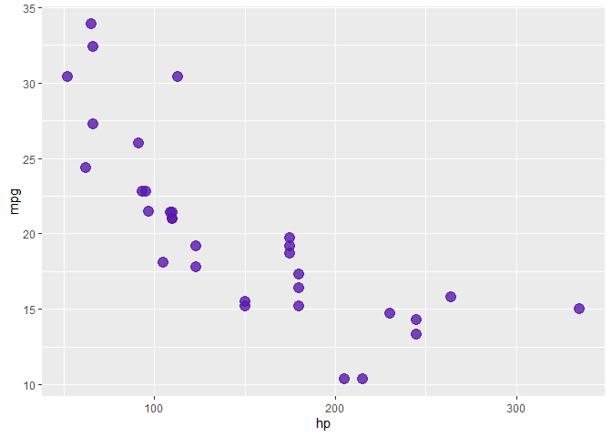
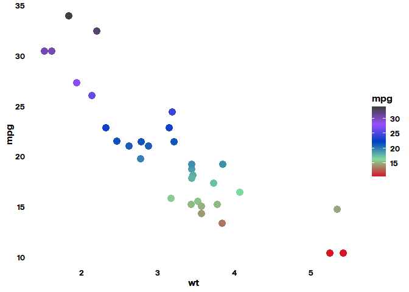
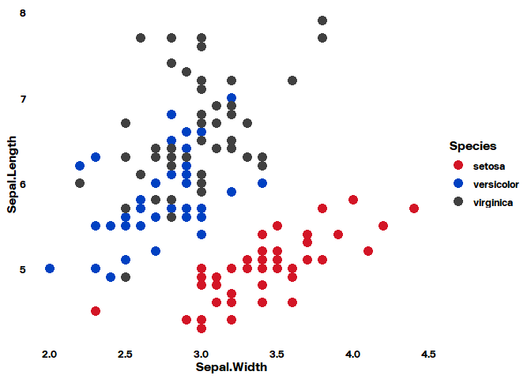
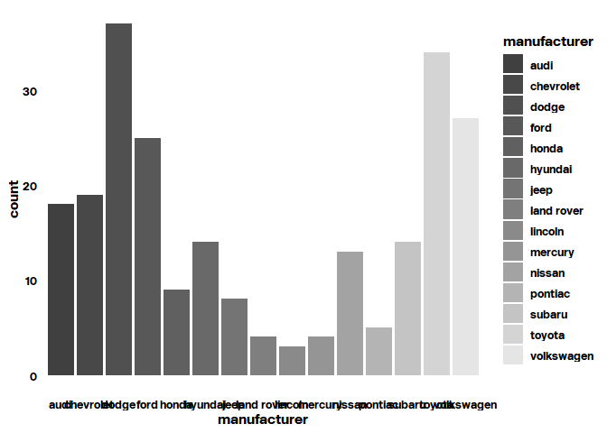

<!-- README.md is generated from README.Rmd. Please edit that file -->

# BicycleTheme2023

<!-- badges: start -->
<!-- badges: end -->

The goal of BicycleTheme2023 is to allow all Bicycle users of ggplot2 to
create Bicycle-themes figures for presentations/posters/dashboards/etc.

## Installation

You can install the development version of BicycleTheme2023 from
[GitHub](https://github.com/) with:

``` r
# install.packages("devtools")
devtools::install_github("jdwells-bicycletx/BicycleTheme2023")
```

The first time you install this package, YOU MUST run:

``` r
check_fonts()
#> Registering font with R using windowsFonts(): New Grotesk
#> Registering font with R using windowsFonts(): New Grotesk Italic
#> Registering font with R using windowsFonts(): Mono
#> Registering font with R using windowsFonts(): New Grotesk Light
#> Registering font with R using windowsFonts(): New Grotesk Light Italic
#> Registering font with R using windowsFonts(): New Grotesk Light Mono
#> Registering font with R using windowsFonts(): New Grotesk Medium
#> Registering font with R using windowsFonts(): New Grotesk Medium Italic
#> Registering font with R using windowsFonts(): New Grotesk Medium Mono
#> Registering font with R using windowsFonts(): New Grotesk Mono
#> Registering font with R using windowsFonts(): New Grotesk Semi Bold
#> Registering font with R using windowsFonts(): New Grotesk Semi Bold Italic
#> No regular (non-bold, non-italic) version of Mono. Skipping setup for this font.
#> Registering font with R using pdfFont(): New Grotesk
#> No regular (non-bold, non-italic) version of New Grotesk Italic. Skipping setup for this font.
#> Registering font with R using pdfFont(): New Grotesk Light
#> No regular (non-bold, non-italic) version of New Grotesk Light Italic. Skipping setup for this font.
#> Registering font with R using pdfFont(): New Grotesk Light Mono
#> Registering font with R using pdfFont(): New Grotesk Medium
#> No regular (non-bold, non-italic) version of New Grotesk Medium Italic. Skipping setup for this font.
#> Registering font with R using pdfFont(): New Grotesk Medium Mono
#> Registering font with R using pdfFont(): New Grotesk Mono
#> Registering font with R using pdfFont(): New Grotesk Semi Bold
#> No regular (non-bold, non-italic) version of New Grotesk Semi Bold Italic. Skipping setup for this font.
#> No regular (non-bold, non-italic) version of Mono. Skipping setup for this font.
#> Registering font with R using postscriptFont(): New Grotesk
#> No regular (non-bold, non-italic) version of New Grotesk Italic. Skipping setup for this font.
#> Registering font with R using postscriptFont(): New Grotesk Light
#> No regular (non-bold, non-italic) version of New Grotesk Light Italic. Skipping setup for this font.
#> Registering font with R using postscriptFont(): New Grotesk Light Mono
#> Registering font with R using postscriptFont(): New Grotesk Medium
#> No regular (non-bold, non-italic) version of New Grotesk Medium Italic. Skipping setup for this font.
#> Registering font with R using postscriptFont(): New Grotesk Medium Mono
#> Registering font with R using postscriptFont(): New Grotesk Mono
#> Registering font with R using postscriptFont(): New Grotesk Semi Bold
#> No regular (non-bold, non-italic) version of New Grotesk Semi Bold Italic. Skipping setup for this font.
```

This may take a minute

## Examples

This is a basic example which shows the use of one color in the theme:

``` r
library(BicycleTheme2023)
#> 
#> Attaching package: 'BicycleTheme2023'
#> The following object is masked _by_ '.GlobalEnv':
#> 
#>     check_fonts
library(ggplot2)
ggplot(mtcars, aes(hp, mpg)) +
  geom_point(color = bicycle_cols('violet'),
             size = 4, alpha = .8)
```



You can reference individual colors using:

``` r
bicycle_pal('bright')(2)
#> [1] "#FF852E" "#999999"
```

STILL NEEDED: a function to list out the palettes and a function to list
out the colors

Coloring by a continuous variable:

``` r
ggplot(mtcars, aes(wt, mpg, color = mpg)) +
  geom_point(size = 4) + theme_bicycle() + 
  scale_color_bicycle(palette = 'main', discrete = FALSE)
```



Coloring by a discrete variable:

``` r
ggplot(iris, aes(Sepal.Width, Sepal.Length, color = Species)) +
  geom_point(size = 4) + theme_bicycle() +
  scale_color_bicycle(palette = 'main')
```



Filling by discrete variable:

``` r
ggplot(mpg, aes(manufacturer, fill = manufacturer)) +
  geom_bar() +
  theme_bicycle() +
  scale_fill_bicycle(palette = "grays")
```



TO BE ADDED: figures that show the colors and the palettes

To use in your scripts: theme_set(theme_bicycle()). Since this is a
skeleton theme, you can always add ggplot2 arguments as needed
